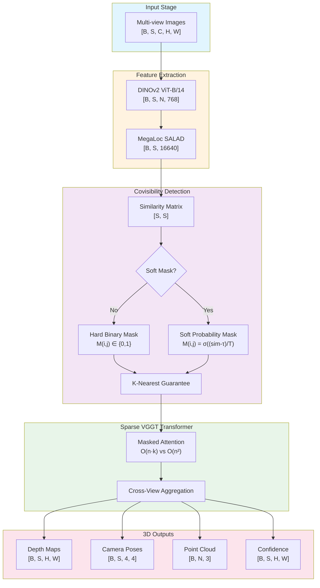
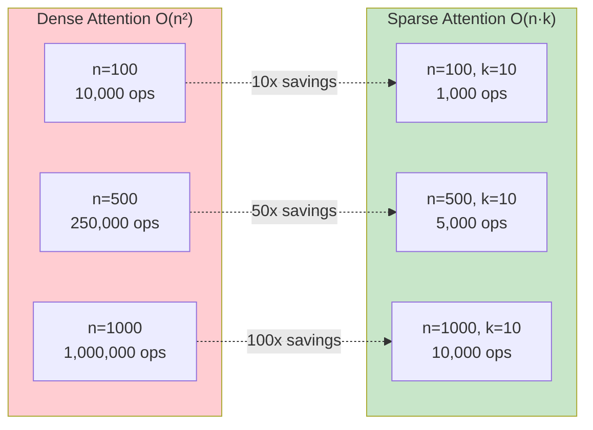
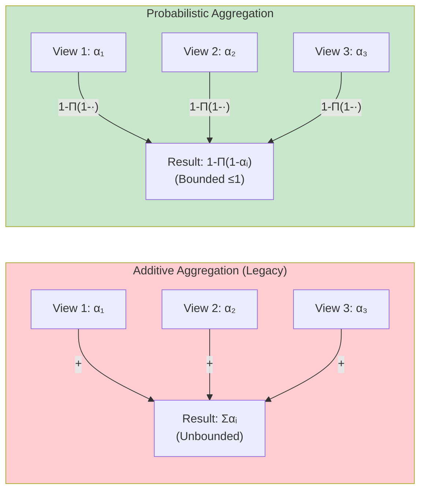
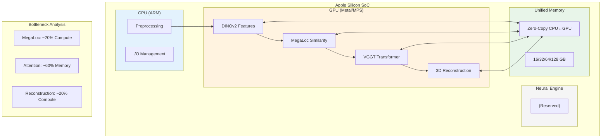

# VGGT-MPS Architecture Diagrams

This directory contains architecture diagrams for VGGT-MPS.

## Diagram 1: Overall Architecture Pipeline



## Diagram 2: Efficiency Comparison (Conceptual)



## Diagram 3: Probabilistic Aggregation



## Diagram 4: MPS Hardware Pipeline



## Diagram 5: Efficiency Metrics

| Metric | Formula | Description |
|--------|---------|-------------|
| **ASR** | \|{M(i,j)=0}\| / (n²-n) | Attention Sparsity Ratio |
| **ECR** | nnz(M) / n² | Effective Computation Ratio |
| **ME** | Mem_sparse / Mem_dense | Memory Efficiency |
| **QER** | ΔQuality / ΔCompute | Quality-Efficiency Ratio |

## Diagram 6: Covisibility Matrix Pattern

```
     Covisibility Matrix (n=50, k=10)

  Images  1  5  10 15 20 25 30 35 40 45 50
    1    [█  █  █  ·  ·  ·  ·  ·  ·  ·  · ]
    5    [█  █  █  █  ·  ·  ·  ·  ·  ·  · ]
   10    [█  █  █  █  █  ·  ·  ·  ·  ·  · ]
   15    [·  █  █  █  █  █  ·  ·  ·  ·  · ]
   20    [·  ·  █  █  █  █  █  ·  ·  ·  · ]
   25    [·  ·  ·  █  █  █  █  █  ·  ·  · ]
   30    [·  ·  ·  ·  █  █  █  █  █  ·  · ]
   35    [·  ·  ·  ·  ·  █  █  █  █  █  · ]
   40    [·  ·  ·  ·  ·  ·  █  █  █  █  █ ]
   45    [·  ·  ·  ·  ·  ·  ·  █  █  █  █ ]
   50    [·  ·  ·  ·  ·  ·  ·  ·  █  █  █ ]

         █ = covisible (attention computed)
         · = not covisible (masked out)

         Sparsity: ~56%
         FLOPs saved: ~56%
```
